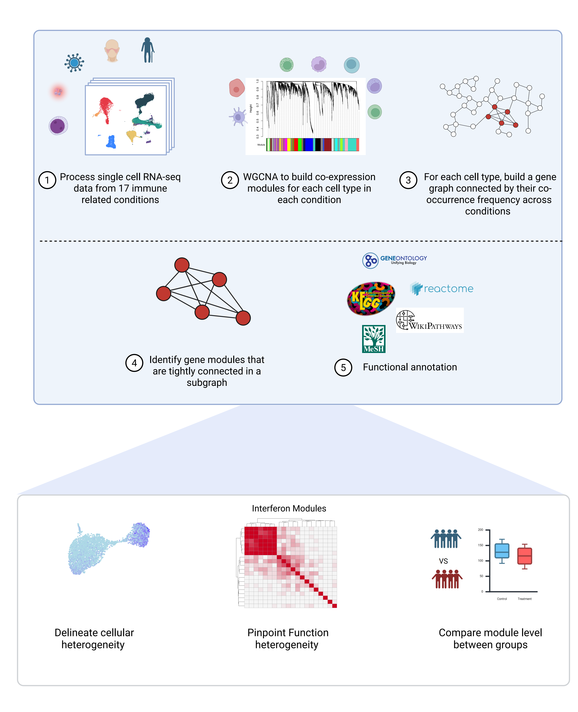
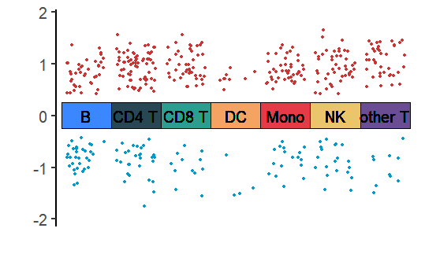
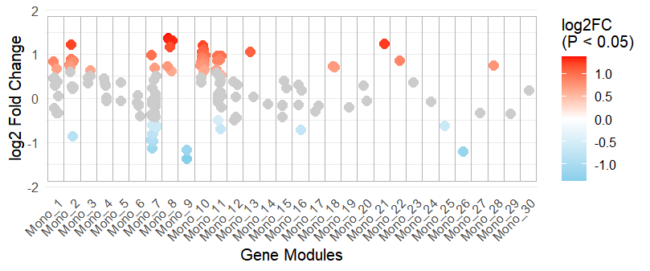
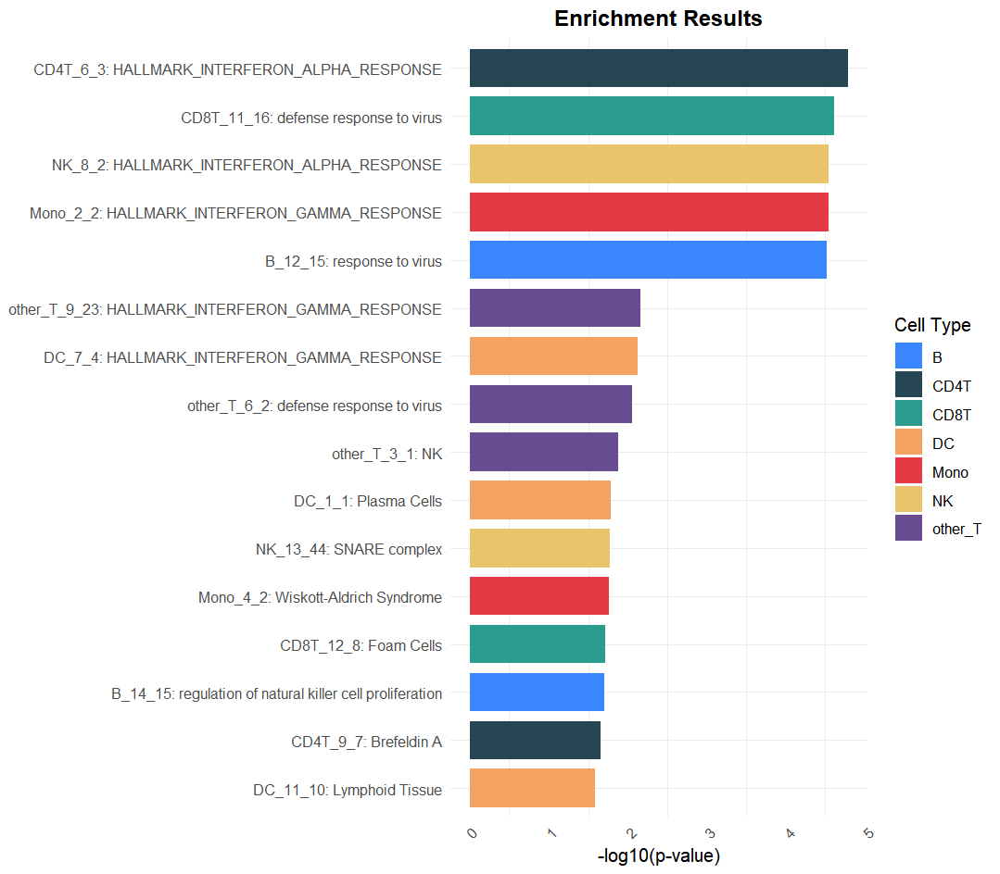

# scImmuneCo
## 1. About
We developed scImmuneCo, a comprehensive resource of cell-type-specific transcriptional modules derived from single-cell RNA sequencing data. Our analytical framework, applied to 17 immunological conditions spanning autoimmunity, immunodeficiency, infection, and hematologic malignancies, identified 873 co-expression modules across seven major immune cell types. 

ScImmuneCo represents a significant methodological advance by providing stable, reusable modules that overcome single-dataset limitations; resolving cell-type-specific functional programs lost in bulk analyses; capturing transitional cellular states often missed by conventional clustering. 



## 2. Intallation


``` r
### install dependency
if (!requireNamespace("BiocManager", quietly = TRUE))
    install.packages("BiocManager")
    
BicocManager::install(c("Seurat", "Azimuth", "GSVA", "ggplot2", "dplyr", "tidyr",                                "ggplot2", "limma"))


library(devtools)
devtools::install_github("FrankQYW/scImmuneCo_R")
```


## 3. Module level expression analysis
### 3.1 Preprocess of the data
A preprocessed PBMC single cell RNA-seq in Seurat format is required to run the scImmuneCo package. Users are suggested to use Azimuth to map the PBMC data to the reference cell types. 


``` r
library(Azimuth)
seurat_object <- RunAzimuth(seurat_object, reference = "pbmcref")
```

As a result, the meta_data of seurat_object will have a 'predicted.celltype.l1' column contain the cell type:


``` r
unique(seurat_object@meta.data$predicted.celltype.l1)

[1] "CD8 T"   "CD4 T"   "Mono"    "other T" "DC"      "B"       "NK"      "other" 
``` 

Users could also manually annotate the single cell data as long as the **name of the cell type** aligned with the ones in Azimuth reference. 


### 3.2 Identify Differentially Expressed Modules Between Conditions
We provide a convenient one line function to test modules in all cell types between two conditions.   


``` r
res <- do_dem(
  seurat_object,
  sample_column = "batch",
  gmt = module_info,
  condition_column = "condition",
  condition1 = "SjS",
  condition2 = "HC"
)
``` 


The users can also choose a specific cell type to test the modules difference between two conditions. 


``` r
gsva_matrix <- gsva_cell_type(seurat_object, cell = 'CD4 T', sample_column = 'batch', 
          cell_column = "predicted.celltype.l1",)

res <- compare_condition(seurat_object, gsva = a, 
                       sample_column = 'batch', 
                       condition_column = 'condition', 
                       condition1 = 'SjS', 
                       condition2 = 'HC')
``` 


### 3.3 Visualization

The overall results can be visualized by 

``` r
draw_volcano(res, p_cutoff = 0.05, logFC_cutoff = 0.25)

``` 




Can also visualize the differential expressed modules on meta module level in each cell type

``` r
Mono_res <- filter(res, res$cell_type == 'Mono')
plot_module_deg(Mono_res)

``` 




## 4. Module Enrichment Analysis
The users can also perform module enrichment analysis on a list of genes. The function will return the enriched modules in each cell type. 

``` r
enrichment_res <- gene_enrichment_scimmuneco(gene_list = c('IFI44', 'IRF7', 'IFITM2'))
plot_enrichment_bars(enrichment_res@result)

```



