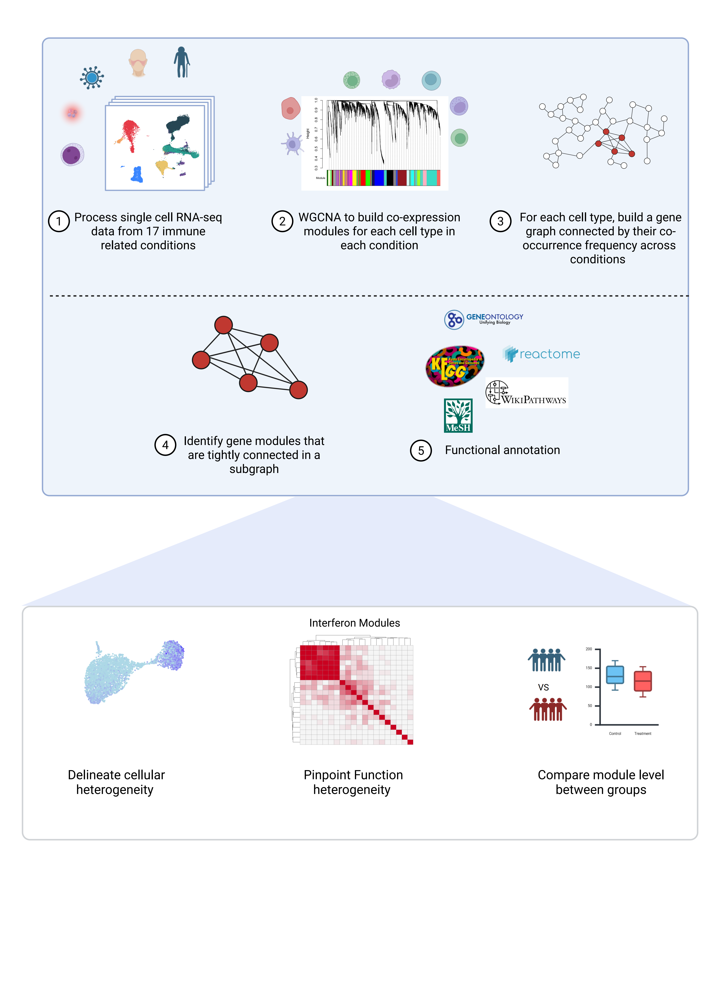

# scImmuneCo

We developed scImmuneCo, a comprehensive resource of cell-type-specific transcriptional modules derived from single-cell RNA sequencing (scRNA-seq) data. Our analytical framework, applied to 17 immunological conditions spanning autoimmunity, immunodeficiency, infection, and hematologic malignancies, identified 873 co-expression modules across seven major immune cell types. 

ScImmuneCo represents a significant methodological advance by providing stable, reusable modules that overcome single-dataset limitations; resolving cell-type-specific functional programs lost in bulk analyses; capturing transitional cellular states often missed by conventional clustering. 




## Intallation
``` r
library(devtools)
devtools::install_github("FrankQYW/scImmuneCo_R")
``` r


## Usage
### Preprocess of the data
A preprocessed PBMC single cell RNA-seq is required to run the scImmuneCo package. Users are suggested to use Azimuth to map the PBMC data to the reference cell types. 


``` r
library(Azimuth)
seurat_object <- RunAzimuth(seurat_object, reference = "pbmcref")
``` r

As a result, the meta_data of seurat_object will have a 'predicted.celltype.l1' column contain the cell type:


``` r
unique(seurat_object@meta.data$predicted.celltype.l1)

[1] "CD8 T"   "CD4 T"   "Mono"    "other T" "DC"      "B"       "NK"      "other" 
``` r

Users could also manually annotate the single cell data as long as the name of the cell type aligned with the ones in Azimuth reference. 


###


